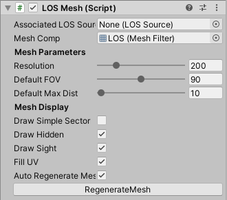
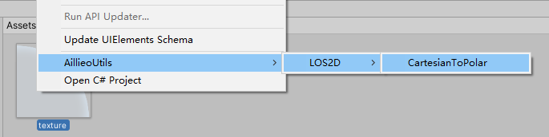
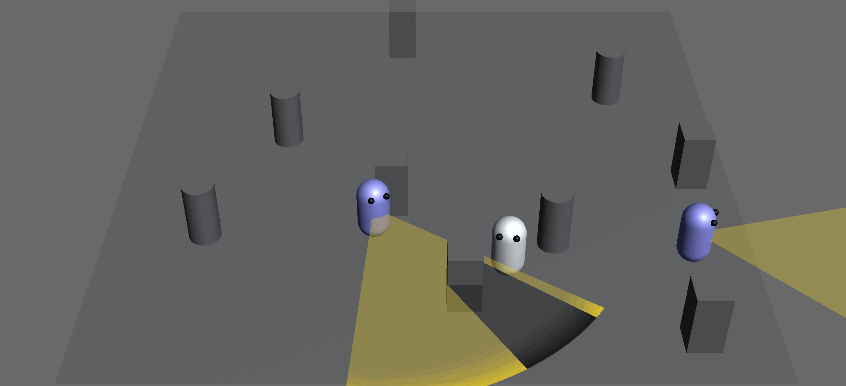

## Unity LOS 2D

A very simple Line of Sight (LOS) implementation with Unity physics ray casting system, including the following features:

1. LOS related events

Register callbacks for static events in `LOSManager`. The available events are `OnEnter` and `OnExit`, which are invoked when a `LOSTarget` enters or exits the line of sight of one `LOSSource`, and instances of both the `LOSSource` and `LOSTarget` are sent to the listeners:

```C#
LOSManager.OnEnter += (source, target) =>
{
    Debug.Log($"{target.name} enters the sight of {source.name}");
};
```

2. Sector shaped mesh generation

`LOSMesh` is for sector-shaped mesh generation, with some configurations:



'Associated LOSSource' : read angle and radius parameters from the given `LOSSource`
`Resolution` : the resolution for the sector
'Default FOV' : the angle of the sector if no `LOSSource` associated
'Default Max Dist' : the radius of the sector if no `LOSSource` associated
'Draw Simple Sector' : turn off target and obstacle detection, only draw sectors
'Draw Hidden' : draw the area blocked by obstacles
'Draw Sight' : draw the bright area that is not blocked by any obstacles
'Fill UV' : generate a mesh with uv
'Auto Regenerate' : regenerate mesh every frame

3. Shader and texture tools for sector-shaped mesh

Shader: use sector-specific textures which supports border settings

Texture tool: convert a 90-degree sector image from Cartesian to the polar coordinate system to better support different radii and angles by setting borders. Right-click on the original texture and select "C2P".



## Sample case:

The sample scene contains a composite example.



## Usage

Clone this repository and copy it to your project folder, or add `https://github.com/aillieo/UnityLOS2D.git#upm` as a dependency in the Package Manager window.